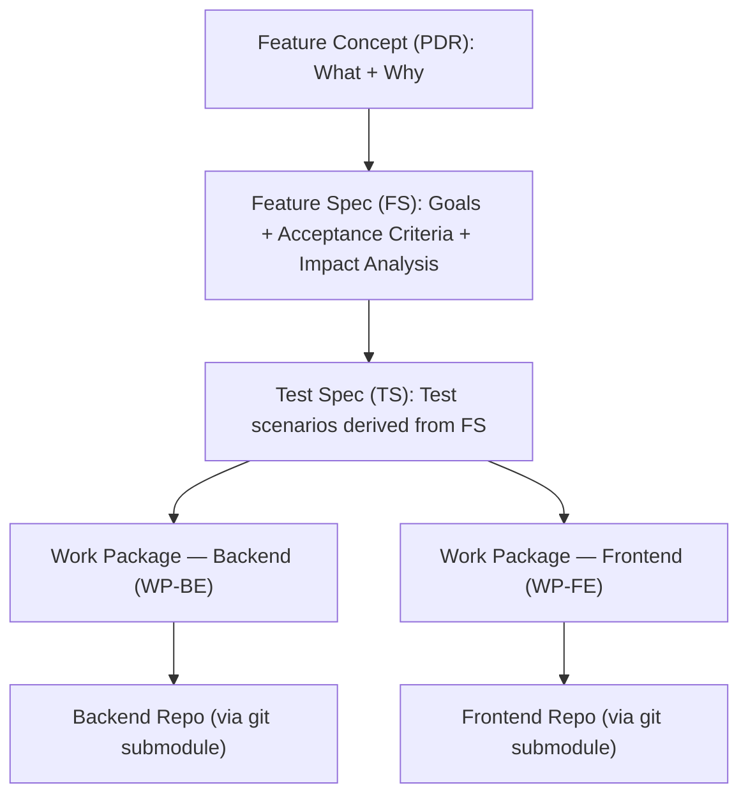

# Specification Hub

The central repo for all feature specs, API contracts, and architecture decisions — where every feature is defined before it's built.

Most software projects discover requirements during implementation — the most expensive time to find them. Missing acceptance criteria, unclear edge cases, and contradicting contracts surface as bugs, rework, and wasted sprints.

**Spec Driven Development (SDD)** addresses this by requiring testable acceptance criteria, impact analysis, and self-contained work packages before implementation begins. AI agents do the breakdown. Humans review and approve. Nothing moves forward until the spec is right.

### Why a separate spec hub?

In polyrepo architectures — where each microservice and app has its own repository — features routinely span multiple repos. A guest checkout feature might touch the order service, inventory service, and storefront app simultaneously. If specs lived inside each code repo, they'd be fragmented across repos — no single place to see the full picture, no way to catch contract conflicts before implementation.

The spec hub solves this by centralizing all specifications, contracts, and architecture decisions in one repo. Code repos (linked as git submodules under `workspaces/`) stay focused on implementation. This gives you:

- **Single source of truth** — one place to see every feature, every contract, every decision across all services
- **Independent lifecycles** — specs are reviewed and approved at their own pace, without triggering CI in code repos
- **Safe parallelism** — multiple AI agents can implement different work packages simultaneously without stepping on each other
- **Cross-service visibility** — impact analysis catches breaking changes across service boundaries before code is written

---

## Getting Started

1. **Clone** the repo with workspace submodules:
   ```bash
   git clone --recurse-submodules <repo-url>
   ```
   Already cloned without submodules? Run `git submodule init && git submodule update`.

2. **Orient yourself:**
   - `plan/spec/` — browse any feature folder to see a real spec, test scenarios, and work packages
   - `plan/reference/` — product glossary, user personas, role definitions
   - `contracts/` — API schemas, data models, architecture decisions

3. **Understand the workflow** — read "How a Feature Goes From Idea to Code" below.

**AI agents:** your entry point is `CLAUDE.md`, loaded automatically on every session.

---

## How a Feature Goes From Idea to Code



| Step | Owner | Reviewer | Skill |
|---|---|---|---|
| Feature Concept (PDR) | Human + AI agent | Human | `/sdd-feature-concept` |
| Feature Spec (FS) + Impact Analysis | Human + AI agent | Human | `/sdd-feature-spec` |
| Test Spec (TS) + Work Packages (WP) | AI agent | Human (reviews both together) | `/sdd-plan` |
| Implementation | AI agent | Human (DoD checklist) | — |

Humans define *what* to build. AI agents break it down into testable scenarios and implementable work packages. Humans review and approve via `status.yaml` before anything moves forward.

To start a new feature: create a folder under `plan/spec/` named `{TICKET-ID}-{slug}` (e.g. `story-0002-user-registration`), then invoke the skills in order. Every artifact must reach `approved` status before the next phase begins.

---

## AI Skills

Skills are reusable workflows that guide the AI agent through each SDD phase. You invoke them by name in your AI coding tool.

### SDD Workflow Skills

| Skill | When to use | What it produces |
|---|---|---|
| `/sdd-feature-concept` | Starting a new feature — define *what* and *why* before any spec work | `PDR-XXX.md` in the feature folder |
| `/sdd-feature-spec` | After the concept is approved — define acceptance criteria with impact analysis | `FS-XXX.md` + `IA-XXX.md` |
| `/sdd-plan` | After the FS is approved — derive test scenarios and split into work packages | `TS-XXX.md` + `WP-XXX-BE.md` / `WP-XXX-FE.md` |
| `/run-dod-checklist` | Before marking a WP as done — runs linters, type checks, tests, and contract validation | Pass/fail report |

### Implementation Skills

These are loaded automatically by the AI agent during Phase 4 when it needs them:

| Skill | Purpose |
|---|---|
| `/add-fastapi-endpoint` | Add a new API route to a FastAPI backend workspace |
| `/add-alembic-migration` | Add a database migration in a backend workspace |
| `/add-react-feature` | Add a new feature module to a React frontend workspace |

---

## Adding a Code Repo

Every service or app lives in its own git repo, linked here as a submodule. Two steps:

**1. Add the submodule:**

```bash
git submodule add <repo-url> workspaces/<service-name>
```

**2. Register it in `registry/routes.yaml`:**

```yaml
workspaces:
  my-new-service:
    path: workspaces/my-new-service
    type: backend              # backend | frontend
    language: python           # python | typescript
    contracts:
      - contracts/api/my-new-service.openapi.yaml
```

The `routes.yaml` entry is how the AI agent knows which workspace a Work Package targets. Without it, WPs can't be routed to your repo.

---

## Where Things Live

| Directory | Purpose | When to look here |
|---|---|---|
| `plan/spec/` | Feature specs, test specs, work packages, and per-feature `status.yaml` | You are building or reviewing a feature |
| `plan/reference/` | Glossary, personas, roles | You need domain context |
| `contracts/` | OpenAPI specs, ADRs, data schemas | You need the technical interface between services |
| `registry/` | `project.yaml` (project metadata) + `routes.yaml` (workspace routing) | You need to know which repo a work package targets |
| `.claude/rules/` | Agent guardrails — loaded and enforced on every session | You want to understand or change agent behavior |
| `.claude/skills/` | Reusable agent skill definitions (see "AI Skills" above) | You want to understand or modify a workflow |
| `workspaces/` | Git submodules — each service/app is a separate repo | You are implementing a work package |

<details>
<summary>Full directory tree</summary>

```
spec-hub/
├── registry/
│   ├── project.yaml               # Project metadata — domain, methodology, standards
│   └── routes.yaml                # Routes work packages to workspace repos
│
├── plan/
│   ├── spec/
│   │   └── story-1234-{slug}/     # One folder per feature (ticket ID + slug)
│   │       ├── PDR-XXX.md         # Feature Concept (Product Discovery Record)
│   │       ├── FS-XXX.md          # Feature Spec
│   │       ├── IA-XXX.md          # Impact Analysis
│   │       ├── TS-XXX.md          # Test Spec
│   │       ├── WP-XXX-BE.md       # Backend Work Package
│   │       ├── WP-XXX-FE.md       # Frontend Work Package
│   │       └── status.yaml        # Phase progress, artifact approval states, blockers
│   └── reference/
│       ├── glossary.md
│       ├── personas.md
│       └── roles.md
│
├── contracts/
│   ├── api/                       # OpenAPI specs (one per microservice)
│   ├── architecture/              # ADRs, patterns, system design
│   └── data-schema/               # Entity definitions, migrations
│
├── .claude/
│   ├── rules/                     # Agent guardrails (loaded every session)
│   └── skills/                    # Reusable agent skill definitions
│
├── workspaces/                    # Part of this repo; each child is a git submodule
│   ├── order-service/             # → git submodule (backend repo)
│   ├── storefront-app/            # → git submodule (frontend repo)
│   └── ...
├── CLAUDE.md                      # AI agent entry point
├── CLAUDE.learnings.md            # Institutional memory (structured by category)
└── README.md                      # This file — human-facing documentation
```

</details>

---

## Branching & Git Workflow

| Repo | Pattern | Example |
|---|---|---|
| Spec-hub | `spec/{story-ID}-{slug}` | `spec/story-0001-guest-checkout` |
| Workspace (backend) | `feat/{story-ID}-{WP-ID}` | `feat/story-0001-WP-001-BE` |
| Workspace (frontend) | `feat/{story-ID}-{WP-ID}` | `feat/story-0001-WP-001-FE` |

- **Spec-hub:** one branch per feature. All spec artifacts committed there. Merged to `main` when the feature reaches Phase 4.
- **Workspaces:** one branch per Work Package. BE and FE always get separate branches.
- **`main` is protected.** No direct commits — not by humans, not by agents.

### Commit message convention

```
feat(story-0001): implement guest order placement saga    ← workspace
spec(story-0002): generate test spec and work packages   ← spec-hub
chore(story-0001): bootstrap order-service workspace     ← scaffold
```

Always include the Story ID in parentheses. See `contracts/architecture/branching-strategy.md` for the full convention.

---

## Feature Status Tracking

Every feature folder contains a `status.yaml` file that the AI agent keeps current throughout the workflow. It is the single source of truth for where a feature stands.

```yaml
feature: story-0001-guest-checkout
current_phase: 4

artifacts:                              # draft | awaiting_review | approved | rejected
  PDR-001:   { status: approved, date: 2026-04-03 }
  FS-001:    { status: approved, date: 2026-04-03 }
  IA-001:    { status: approved, date: 2026-04-03 }
  TS-001:    { status: approved, date: 2026-04-03 }
  WP-001-BE: { status: approved, date: 2026-04-03 }
  WP-001-FE: { status: approved, date: 2026-04-03 }

phase_4:                                # not_started | in_progress | blocked | done
  WP-001-BE: { status: in_progress, last_checkpoint: "saga step 2 — reserve stock" }
  WP-001-FE: { status: not_started }

blockers: []
notes: ~
```

When a session is interrupted, the agent reads `status.yaml` first and resumes from `last_checkpoint` — not from scratch.

---

## ID Conventions

| Artifact | Pattern | Example |
|---|---|---|
| Feature Concept (PDR) | `PDR-XXX` | `PDR-001` |
| Feature Spec | `FS-XXX` | `FS-001` |
| Impact Analysis | `IA-XXX` | `IA-001` |
| Test Spec | `TS-XXX` | `TS-001` |
| Backend Work Package | `WP-XXX-BE` | `WP-001-BE` |
| Frontend Work Package | `WP-XXX-FE` | `WP-001-FE` |
| Architecture Decision | `ADR-XXX` | `ADR-001` |

---

## SDD Maturity Levels

SDD is adopted incrementally. We are currently at **Level 2**.

| Level | Name | What it means |
|---|---|---|
| 1 | Vibe Coding | Ad-hoc development, no formal spec |
| 2 | **Spec-First (current)** | Specs written before implementation |
| 3 | Spec-Anchored | Specs versioned, reviewed, and linked to CI/CD |
| 4 | Spec-as-Source | Specs generate tests, contracts, and scaffolding automatically |
