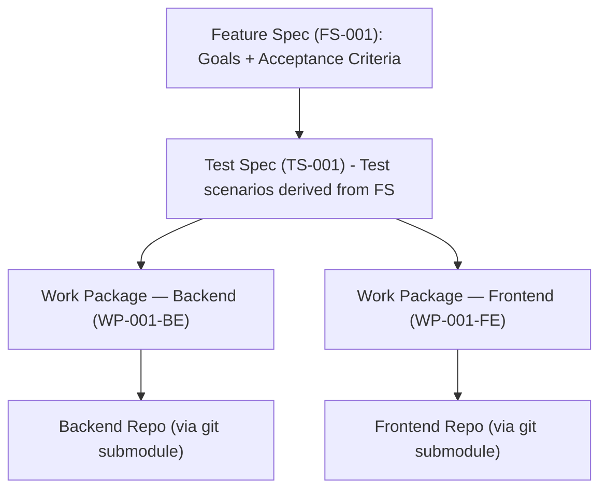
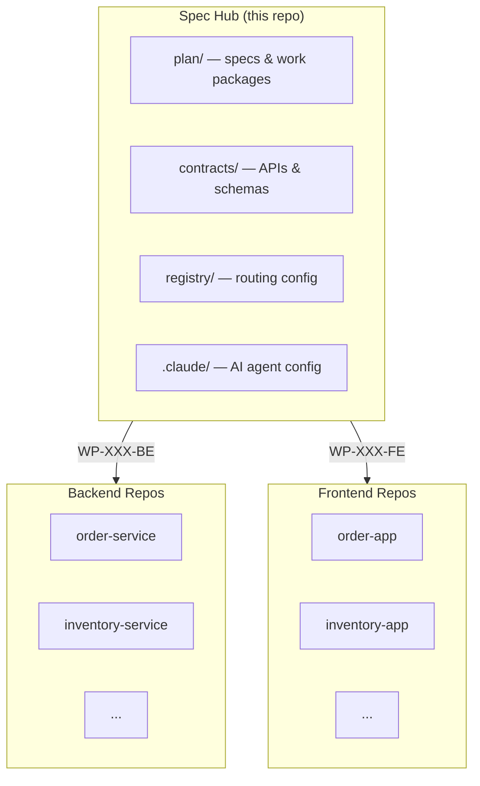

# Specification Hub

> Specs live here. Code lives elsewhere. This is the single source of truth for *what* we build and *why*.

---

## What Is This Repo?

We practice **Spec Driven Development (SDD)** -- every feature is specified before it is coded. This repository holds those specifications, along with API contracts, architecture decisions, and the routing config that connects specs to the repos where code gets written.

No production code lives here.

---

## Getting Started

**New to the team?** Here is the shortest path to orientation:

1. Read this README to understand the repo structure and workflow.
2. Browse `plan/spec/` -- pick any feature folder to see a real spec, its test scenarios, and the work packages derived from it.
3. Check `plan/reference/` for the product glossary, user personas, and role definitions.
4. If you need to understand cross-service contracts (API schemas, data models, architecture decisions), look in `contracts/`.

**AI agents:** your entry point is `CLAUDE.md`, loaded automatically on every session.

### Setup

Clone the repo with all workspace submodules:

```bash
git clone --recurse-submodules <repo-url>
```

If you already cloned without `--recurse-submodules`, initialize them after the fact:

```bash
git submodule init
git submodule update
```

To add a new workspace submodule (e.g. a new microservice or frontend app):

```bash
git submodule add <workspace-repo-url> workspaces/<service-name>
```

---

## How a Feature Goes From Idea to Code



**Who does what:**

| Step | Owner | Reviewer |
|---|---|---|
| Feature Spec (FS) | Human | -- |
| Test Spec (TS) | AI agent | Human |
| Work Packages (WP) | AI agent | Human |

Humans define *what* to build. AI agents break it down into testable scenarios and implementable work packages. Humans review before anything moves forward.

Every work package is **self-contained** -- an implementer should be able to complete it without reading the rest of the spec tree.

---

## Where Things Live

The repo has four top-level concerns:

| Directory | Purpose | When to look here |
|---|---|---|
| `plan/spec/` | Feature specs, test specs, work packages, and per-feature `status.yaml` | You are building or reviewing a feature |
| `plan/reference/` | Glossary, personas, roles | You need domain context |
| `contracts/` | OpenAPI specs, ADRs, data schemas | You need the technical interface between services |
| `registry/` | `project.yaml` (project metadata) + `routes.yaml` (workspaces & WP routing) | You need to know which repo a work package targets, or the project context |

Supporting directories:

| Directory | Purpose |
|---|---|
| `.claude/commands/` | Slash command definitions for the AI agent |
| `.claude/rules/` | Agent guardrails — loaded and enforced on every session |
| `.claude/skills/` | Reusable agent skill definitions |
| `workspaces/` | Part of this repo; each service/app inside is a git submodule pointing to its own repo |

<details>
<summary>Full directory tree</summary>

```
spec-hub/
├── registry/
│   ├── project.yaml               # Project metadata — domain, methodology, standards
│   └── routes.yaml                # Routes work packages to workspace repos
│
├── plan/
│   ├── spec/
│   │   └── Story-1234-{slug}/     # One folder per feature (ticket ID + slug)
│   │       ├── FS-XXX.md          # Feature Spec
│   │       ├── TS-XXX.md          # Test Spec
│   │       ├── WP-XXX-BE.md       # Backend Work Package
│   │       ├── WP-XXX-FE.md       # Frontend Work Package
│   │       └── status.yaml        # Phase progress, artifact approval states, blockers
│   └── reference/
│       ├── glossary.md
│       ├── personas.md
│       └── roles.md
│
├── contracts/
│   ├── api/                       # OpenAPI specs (one per microservice)
│   ├── architecture/              # ADRs, patterns, system design
│   └── data-schema/               # Entity definitions, migrations
│
├── .claude/
│   ├── commands/                  # Slash command definitions (/autopilot, /new-spec, /review-spec)
│   ├── rules/                     # Agent guardrails (loaded every session)
│   └── skills/                    # Reusable agent skill definitions
│
├── workspaces/                    # Part of this repo; each child is a git submodule
│   ├── order-service/             # → git submodule (backend repo)
│   ├── storefront-app/            # → git submodule (frontend repo)
│   └── ...
├── CLAUDE.md                      # AI agent entry point
├── CLAUDE.learnings.md            # Institutional memory (structured by category)
└── README.md                      # This file — human-facing documentation
```

</details>

---

## Hub and Workspace Architecture



- **Spec Hub** (this repo) -- holds specs, contracts, AI config, and routing. Zero code.
- **Workspaces** -- the `workspaces/` directory is part of this repo, but each service or app inside it is a separate git submodule pointing to its own repository. This is where engineers and AI agents implement work packages.
- **Registry** (`registry/routes.yaml`) -- the routing layer that maps each work package to its target workspace.

---

## Writing a New Spec

To add a specification for a new feature:

1. Create a folder under `plan/spec/` named `{TICKET-ID}-{slug}` (e.g. `Story-0002-user-registration`).
2. **Human** authors `FS-XXX.md` — define the goal, acceptance criteria, and status. Include `Depends on` and `Blocks` fields in the header if this feature has dependencies (see below).
3. **AI agent** derives `TS-XXX.md` — test scenarios that trace back to each acceptance criterion. Agent creates `status.yaml` to begin tracking progress. **Human reviews.**
4. **AI agent** splits into work packages: `WP-XXX-BE.md` and/or `WP-XXX-FE.md`. Each must be self-contained. **Human reviews.**
5. **AI agent** implements in the target workspace, updating `status.yaml` after each significant step to maintain a recovery checkpoint.
6. **Human** updates `registry/routes.yaml` if the feature targets a workspace not yet registered.

### Feature Spec header format

Every `FS-XXX.md` starts with this header block:

```markdown
**Feature folder:** `Story-XXXX-{slug}`
**Status:** Draft | Approved
**Author:** Product Team
**Last updated:** YYYY-MM-DD
**Depends on:** — (none) | `FS-002` — needs authenticated session endpoint
**Blocks:** — (none) | `FS-005` — order history requires orders to exist
```

`Depends on` tells the agent which other features must be complete (or mockable) before this one can be fully implemented. If a dependency is still in progress, the frontend WP will use contract mocks against the dependency's OpenAPI spec until the real implementation is available.

---

## Branching & Git Workflow

### Branch naming

| Repo | Pattern | Example |
|---|---|---|
| Spec-hub | `spec/{Story-ID}-{slug}` | `spec/Story-0001-guest-checkout` |
| Workspace (backend) | `feat/{Story-ID}-{WP-ID}` | `feat/Story-0001-WP-001-BE` |
| Workspace (frontend) | `feat/{Story-ID}-{WP-ID}` | `feat/Story-0001-WP-001-FE` |

- **Spec-hub:** one branch per feature, covering Phase 2 and Phase 3. All spec artifacts (TS, WPs, status updates, contract changes) are committed there. Merged to `main` when the feature reaches Phase 4.
- **Workspaces:** one branch per Work Package. BE and FE always get separate branches, so parallel development never causes conflicts.
- **`main` is protected.** No direct commits — not by humans, not by agents.

### Commit message convention

```
feat(Story-0001): implement guest order placement saga    ← workspace
spec(Story-0002): generate test spec and work packages   ← spec-hub
chore(Story-0001): bootstrap order-service workspace     ← scaffold
```

Always include the Story ID in parentheses. See `contracts/architecture/branching-strategy.md` for the full convention.

### Agent behaviour

Before the first commit in any repo, the agent asks:

> "Should I create a feature branch `{branch-name}` for this work, or will you manage branching?"

- **Yes** → the agent creates the branch and works there.
- **You manage it** → the agent commits to whatever branch is currently active.

One question, one time per feature (spec-hub) or per WP (workspace). The agent never commits directly to `main`.

---

## Feature Status Tracking

Every feature folder contains a `status.yaml` file that the AI agent keeps current throughout the workflow. It is the single source of truth for where a feature stands — no need to infer state from file existence.

```yaml
feature: Story-0001-guest-checkout
current_phase: 4

artifacts:                              # draft | awaiting_review | approved | rejected
  FS-001:    { status: approved, date: 2026-04-03 }
  TS-001:    { status: approved, date: 2026-04-03 }
  WP-001-BE: { status: approved, date: 2026-04-03 }
  WP-001-FE: { status: approved, date: 2026-04-03 }

phase_4:                                # not_started | in_progress | blocked | done
  WP-001-BE: { status: in_progress, last_checkpoint: "saga step 2 — reserve stock" }
  WP-001-FE: { status: not_started }

blockers: []
notes: ~
```

When a session is interrupted, the agent reads `status.yaml` first and resumes from `last_checkpoint` — not from scratch.

---

## ID Conventions

| Artifact | Pattern | Example |
|---|---|---|
| Feature Spec | `FS-XXX` | `FS-001` |
| Test Spec | `TS-XXX` | `TS-001` |
| Backend Work Package | `WP-XXX-BE` | `WP-001-BE` |
| Frontend Work Package | `WP-XXX-FE` | `WP-001-FE` |
| Architecture Decision | `ADR-XXX` | `ADR-001` |

---

## SDD Maturity Levels

SDD is adopted incrementally. We are currently at **Level 2**.

| Level | Name | What it means |
|---|---|---|
| 1 | Vibe Coding | Ad-hoc development, no formal spec |
| 2 | **Spec-First (current)** | Specs written before implementation |
| 3 | Spec-Anchored | Specs versioned, reviewed, and linked to CI/CD |
| 4 | Spec-as-Source | Specs generate tests, contracts, and scaffolding automatically |
