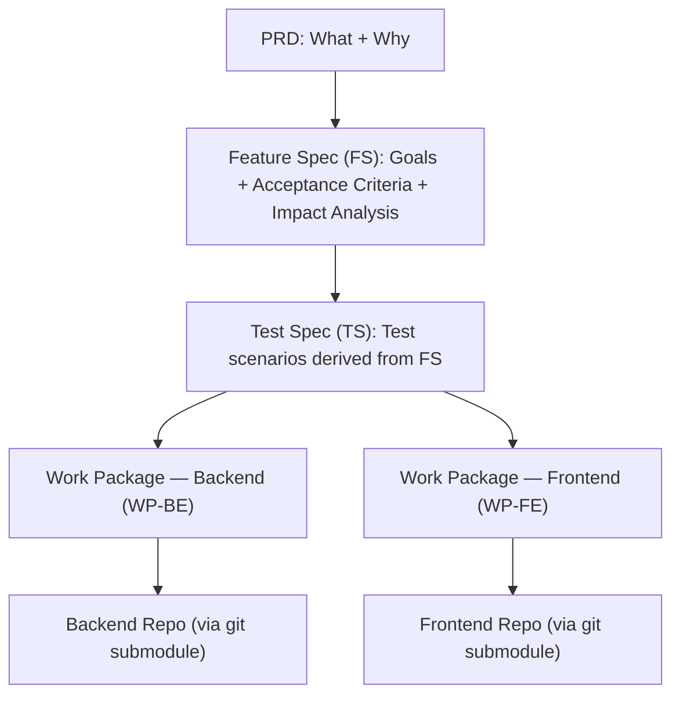

# Spec-Driven Development (SDD) Blueprint

Most AI coding tools assume you have a monorepo. One codebase, one context, one agent that can see everything.

That's not reality for most companies.

Enterprises run polyrepo architectures — separate services, separate teams, separate repos. Each codebase is big. Each has its own patterns, its own history, its own conventions. Merging them into a monorepo isn't happening.

So when you use AI coding tools, you hit a wall. You can get help inside one codebase at a time. But the coordination — decomposing a feature across services, keeping contracts in sync, sequencing work so nothing breaks — that's the hard part. And no tool solves it.

**SDD Blueprint** is a framework that solves this. It introduces a central spec repository that sits above your service repos and coordinates AI-assisted development across them.

---

## Getting Started

1. **Clone** the repo with workspace submodules:
   ```bash
    git clone --recurse-submodules git@github.com:tankibaj/spec-driven-dev.git
    cd spec-driven-dev
   ```
   Already cloned without submodules? Run `git submodule init && git submodule update`.

2. **Orient yourself:**
   - `spec/` — browse any feature folder to see a real spec, test scenarios, and work packages
   - `docs/reference/` — product glossary, user personas, role definitions
   - `docs/architecture/` — ADRs, patterns, system design
   - `workspaces/` — git submodules, each with CI-generated docs (`openapi.json`, `entities.md` for BE; `routes.md`, `consumed-endpoints.md` for FE)

**AI agents:** your entry point is `CLAUDE.md`, loaded automatically on every session.

---

## How It Works

SDD decomposes a feature into four phases. Each phase produces artifacts. Each artifact requires human approval before the next phase begins.

```
Phase 0           Phase 1           Phase 2+3           Phase 4
PRD             → Feature Spec   → Test Spec          → Implementation
(what & why)      (acceptance      + Work Packages       (AI executes
                   criteria)        (scoped units)        WPs in parallel)
```



### Phase 0 — PRD (Product Requirements Document)

Define **what** to build, **why**, and **for whom**. No implementation details. Just the problem and the proposed solution at a high level.

Human reviews and approves before moving on.

### Phase 1 — Feature Spec (FS) + Impact Analysis

Define **acceptance criteria** — testable, unambiguous conditions that the feature must satisfy. Run impact analysis across workspaces. Identify which contracts (OpenAPI specs, data schemas) are affected and how.

Human reviews and approves before moving on.

### Phase 2+3 — Test Spec + Work Packages (TS + WPs)

Break the feature spec into **scoped work packages**, each targeting a single workspace repo. Each WP has:

- A target workspace (e.g. `order-service`, `storefront-app`)
- Specific acceptance criteria it satisfies
- Contract changes it must implement
- A definition of done with test requirements

Work packages are sized so an AI agent can execute one in a single session with full context. Independent WPs targeting different repos run in parallel.

Human reviews and approves before moving on.

### Phase 4 — Implementation

AI agents execute the approved work packages. Each agent works inside a single workspace repo with a scoped, well-defined task. Contracts ensure the pieces fit together. Tests verify each WP against the acceptance criteria.

No guessing. No drift. Every line of code traces back to an approved spec.


| Step                                | Owner            | Reviewer                      | Skill        |
|-------------------------------------|------------------|-------------------------------|--------------|
| PRD (Product Requirements Document) | Human + AI agent | Human                         | `/prd`       |
| Feature Spec (FS) + Impact Analysis | Human + AI agent | Human                         | `/spec`      |
| Test Spec (TS) + Work Packages (WP) | AI agent         | Human (reviews both together) | `/plan`      |
| Implementation                      | AI agent         | Human (DoD checklist)         | `/implement` |

Humans define *what* to build. AI agents break it down into testable scenarios and implementable work packages. Humans review and approve via `status.yaml` before anything moves forward.

To start a new feature: create a folder under `spec/` named `{feature-ID}-{slug}` (e.g. `002-user-registration`), then invoke the skills in order. Every artifact must reach `approved` status before the next phase begins.

---

## AI Skills

Skills are reusable workflows that guide the AI agent through each SDD phase. You invoke them by name in your AI coding tool.

### SDD Workflow Skills

| Skill                | When to use                                                                             | What it produces                              |
|----------------------|-----------------------------------------------------------------------------------------|-----------------------------------------------|
| `/prd`               | Starting a new feature — define *what* and *why* before any spec work                   | `PRD-XXX.md` in the feature folder            |
| `/spec`              | After the PRD is approved — define acceptance criteria with impact analysis              | `FS-XXX.md` + `IA-XXX.md`                     |
| `/plan`              | After the FS is approved — derive test scenarios and split into work packages           | `TS-XXX.md` + `WP-XXX-BE.md` / `WP-XXX-FE.md` |
| `/implement`         | After WPs are approved — orchestrates execution across workspace repos                  | Code in workspace submodules                   |

---

## Adding a Code Repo

Every service or app lives in its own git repo, linked here as a submodule. Two steps:

**1. Add the submodule:**

```bash
git submodule add <repo-url> workspaces/<service-name>
```

**2. Register it in `routes.yaml`:**

```yaml
workspaces:
  my-new-service:
    path: workspaces/my-new-service
    type: backend              # backend | frontend
    language: python           # python | typescript
    contracts:
      - workspaces/my-new-service/docs/api/openapi.json
```

The `routes.yaml` entry is how the AI agent knows which workspace a Work Package targets. Without it, WPs can't be routed to your repo.

---

## Where Things Live

| Directory         | Purpose                                                                 | When to look here                                  |
|-------------------|-------------------------------------------------------------------------|----------------------------------------------------|
| `spec/`           | Feature specs, test specs, work packages, and per-feature `status.yaml` | You are building or reviewing a feature            |
| `docs/reference/` | Glossary, personas, roles                                               | You need domain context                            |
| `docs/architecture/` | ADRs, patterns, system design                                        | You need architecture decisions or standards       |
| `docs/project.md` | Project metadata — domain, methodology, standards                       | You need project context                           |
| `routes.yaml`     | Routes work packages to workspace repos                                 | You need to know which repo a work package targets |
| `.claude/rules/`  | Agent guardrails — loaded and enforced on every session                 | You want to understand or change agent behavior    |
| `.claude/skills/` | Reusable agent skill definitions (see "AI Skills" above)                | You want to understand or modify a workflow        |
| `workspaces/`     | Git submodules — each service/app is a separate repo                    | You are implementing a work package                |

<details>
<summary>Full directory tree</summary>

```
spec-hub/
├── spec/
│   └── {XXX}-{slug}/              # One folder per feature (feature ID + slug)
│       ├── PRD-XXX.md             # PRD (Product Requirements Document)
│       ├── FS-XXX.md              # Feature Spec
│       ├── IA-XXX.md              # Impact Analysis
│       ├── TS-XXX.md              # Test Spec
│       ├── WP-XXX-BE.md           # Backend Work Package
│       ├── WP-XXX-FE.md           # Frontend Work Package
│       └── status.yaml            # Phase progress, artifact approval states, blockers
│
├── docs/
│   ├── reference/
│   │   ├── glossary.md
│   │   ├── personas.md
│   │   └── roles.md
│   ├── architecture/              # ADRs, patterns, system design
│   └── project.md                 # Project metadata — domain, methodology, standards
│
├── routes.yaml                    # Routes work packages to workspace repos
│
├── .claude/
│   ├── rules/                     # Agent guardrails (loaded every session)
│   └── skills/                    # Reusable agent skill definitions
│
├── workspaces/                    # Part of this repo; each child is a git submodule
│   ├── order-service/             # → git submodule (backend repo)
│   │   ├── docs/api/openapi.json  #   CI-generated OpenAPI spec (read-only)
│   │   └── docs/schema/entities.md #  CI-generated entity definitions (read-only)
│   ├── storefront-app/            # → git submodule (frontend repo)
│   │   ├── docs/routes.md         #   CI-generated route manifest (read-only)
│   │   └── docs/consumed-endpoints.md # CI-generated API dependency manifest (read-only)
│   └── ...
├── CLAUDE.md                      # AI agent entry point
├── CLAUDE.learnings.md            # Institutional memory (structured by category)
└── README.md                      # This file — human-facing documentation
```

</details>

---

## Branching & Git Workflow

| Repo | Pattern | Example |
|---|---|---|
| Spec-hub | `spec/{feature-ID}-{slug}` | `spec/001-guest-checkout` |
| Workspace (backend) | `feat/{feature-ID}-{WP-ID}` | `feat/001-WP-001-BE` |
| Workspace (frontend) | `feat/{feature-ID}-{WP-ID}` | `feat/001-WP-001-FE` |

- **Spec-hub:** one branch per feature. All spec artifacts committed there. Merged to `main` when the feature reaches Phase 4.
- **Workspaces:** one branch per Work Package. BE and FE always get separate branches.
- **`main` is protected.** No direct commits — not by humans, not by agents.

### Commit message convention

```
feat(001): implement guest order placement saga    ← workspace
spec(002): generate test spec and work packages   ← spec-hub
chore(001): bootstrap order-service workspace     ← scaffold
```

Always include the feature ID in parentheses. See `.claude/rules/branching-strategy.md` for the full convention.

---

## Feature Status Tracking

Every feature folder contains a `status.yaml` file that the AI agent keeps current throughout the workflow. It is the single source of truth for where a feature stands.

```yaml
feature: 001-guest-checkout
current_phase: 4

artifacts:                              # draft | awaiting_review | approved | rejected
  PRD-001:   { status: approved, date: 2026-04-03 }
  FS-001:    { status: approved, date: 2026-04-03 }
  IA-001:    { status: approved, date: 2026-04-03 }
  TS-001:    { status: approved, date: 2026-04-03 }
  WP-001-BE: { status: approved, date: 2026-04-03 }
  WP-001-FE: { status: approved, date: 2026-04-03 }

phase_4:                                # not_started | in_progress | blocked | done
  WP-001-BE: { status: in_progress, last_checkpoint: "saga step 2 — reserve stock" }
  WP-001-FE: { status: not_started }

blockers: []
notes: ~
```

When a session is interrupted, the agent reads `status.yaml` first and resumes from `last_checkpoint` — not from scratch.

---

## ID Conventions

| Artifact | Pattern | Example |
|---|---|---|
| PRD (Product Requirements Document) | `PRD-XXX` | `PRD-001` |
| Feature Spec | `FS-XXX` | `FS-001` |
| Impact Analysis | `IA-XXX` | `IA-001` |
| Test Spec | `TS-XXX` | `TS-001` |
| Backend Work Package | `WP-XXX-BE` | `WP-001-BE` |
| Frontend Work Package | `WP-XXX-FE` | `WP-001-FE` |
| Architecture Decision | `ADR-XXX` | `ADR-001` |

