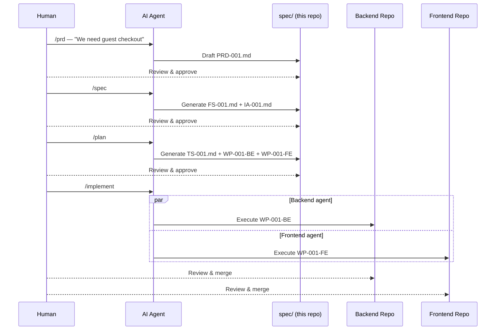
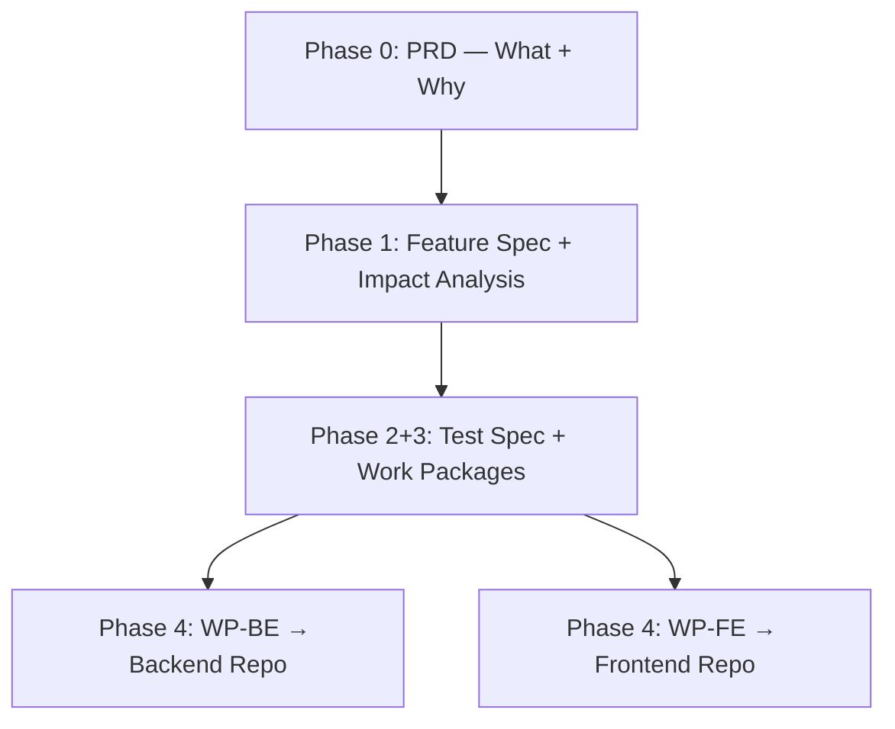

# Spec-Driven Development (SDD) Blueprint

Most AI coding tools assume you have a monorepo. One codebase, one context, one agent that can see everything.

That's not reality for most companies.

Enterprises run polyrepo architectures — separate services, separate teams, separate repos. Each codebase is big. Each has its own patterns, its own history, its own conventions. Merging them into a monorepo isn't happening.

So when you use AI coding tools, you hit a wall. You can get help inside one codebase at a time. But the coordination — decomposing a feature across services, keeping contracts in sync, sequencing work so nothing breaks — that's the hard part. And no tool solves it.

**SDD Blueprint** is a framework that solves this. It introduces a central spec repository that sits above your service repos and coordinates AI-assisted development across them.



---

## Getting Started

**1. Clone the repo:**

```bash
git clone --recurse-submodules git@github.com:tankibaj/spec-driven-dev.git
cd spec-driven-dev
```

Already cloned without submodules? Run `git submodule init && git submodule update`.

**2. Start building** — create a folder under `spec/` named `{feature-ID}-{slug}` (e.g. `002-user-registration`), then invoke skills in order:

| Skill                | When to use                                                              | What it produces                                | Owner            | Reviewer                      |
|----------------------|--------------------------------------------------------------------------|-------------------------------------------------|------------------|-------------------------------|
| `/prd`               | Starting a new feature — define *what* and *why*                         | `PRD-XXX.md`                                    | Human + AI agent | Human                         |
| `/spec`              | After the PRD is approved — acceptance criteria + impact analysis         | `FS-XXX.md` + `IA-XXX.md`                       | Human + AI agent | Human                         |
| `/plan`              | After the FS is approved — test scenarios and scoped work packages       | `TS-XXX.md` + `WP-XXX-BE.md` / `WP-XXX-FE.md`  | AI agent         | Human                         |
| `/implement`         | After WPs are approved — execute in workspace repos                      | Code in workspace submodules                     | AI agent         | Human (DoD checklist)         |

Every artifact must reach `approved` status before the next phase begins.

**AI agents:** your entry point is `CLAUDE.md`, loaded automatically on every session.

---

## How It Works

SDD decomposes a feature into four phases. Each phase produces artifacts that the human approves before the next phase begins.



**Phase 0 — PRD:** Define **what** to build, **why**, and **for whom**. No implementation details.

**Phase 1 — Feature Spec + Impact Analysis:** Define **acceptance criteria** — testable, unambiguous conditions. Identify which workspaces and contracts are affected.

**Phase 2+3 — Test Spec + Work Packages:** Break the spec into **scoped work packages**, each targeting a single workspace repo with specific ACs, contract changes, and a definition of done. Independent WPs run in parallel.

**Phase 4 — Implementation:** AI agents execute approved WPs autonomously. Each agent works inside one workspace with a scoped task. Every line of code traces back to an approved spec.

---

## Adding a Code Repo

Every service or app lives in its own git repo, linked here as a submodule:

```bash
git submodule add <repo-url> workspaces/<service-name>
```

Then register it in `routes.yaml` so WPs can be routed to it:

```yaml
workspaces:
  my-new-service:
    path: workspaces/my-new-service
    type: backend              # backend | frontend
    language: python           # python | typescript
    contracts:
      - workspaces/my-new-service/docs/api/openapi.json
```

---

## Repository Structure

| Directory            | Purpose                                                    |
|----------------------|------------------------------------------------------------|
| `spec/`              | Feature specs, test specs, work packages, `status.yaml`    |
| `docs/reference/`    | Glossary, personas, roles                                  |
| `docs/architecture/` | ADRs, patterns, system design                              |
| `docs/project.md`    | Project metadata — domain, methodology, standards          |
| `routes.yaml`        | Maps work packages to workspace repos                      |
| `.claude/rules/`     | Agent guardrails (loaded every session)                    |
| `.claude/skills/`    | Skill definitions (see Getting Started)                    |
| `workspaces/`        | Git submodules — each service/app is a separate repo       |

<details>
<summary>Full directory tree</summary>

```
spec-hub/
├── spec/
│   └── {XXX}-{slug}/
│       ├── PRD-XXX.md
│       ├── FS-XXX.md
│       ├── IA-XXX.md
│       ├── TS-XXX.md
│       ├── WP-XXX-BE.md
│       ├── WP-XXX-FE.md
│       └── status.yaml
│
├── docs/
│   ├── reference/
│   │   ├── glossary.md
│   │   ├── personas.md
│   │   └── roles.md
│   ├── architecture/
│   └── project.md
│
├── routes.yaml
│
├── .claude/
│   ├── rules/
│   └── skills/
│
├── workspaces/
│   ├── order-service/             # backend submodule
│   │   ├── docs/api/openapi.json  #   CI-generated (read-only)
│   │   └── docs/schema/entities.md
│   ├── storefront-app/            # frontend submodule
│   │   ├── docs/routes.md         #   CI-generated (read-only)
│   │   └── docs/consumed-endpoints.md
│   └── ...
│
├── CLAUDE.md
├── CLAUDE.learnings.md
└── README.md
```

</details>

---

## Branching & Git Workflow

| Repo | Branch pattern | Example |
|---|---|---|
| Spec-hub | `spec/{feature-ID}-{slug}` | `spec/001-guest-checkout` |
| Workspace | `feat/{feature-ID}-{WP-ID}` | `feat/001-WP-001-BE` |

Spec-hub uses one branch per feature. Workspaces use one branch per Work Package (BE and FE always separate). `main` is protected everywhere.

### Commit messages

```
feat(001): implement guest order placement saga    ← workspace
spec(002): generate test spec and work packages   ← spec-hub
```

Always include the feature ID. See `.claude/rules/branching-strategy.md` for the full convention.

---

## Feature Status Tracking

Each feature folder has a `status.yaml` — the single source of truth for where a feature stands. The agent updates it after every significant step and resumes from `last_checkpoint` on session recovery.

```yaml
feature: 001-guest-checkout
current_phase: 4

artifacts:                              # draft | awaiting_review | approved | rejected
  PRD-001:   { status: approved, date: 2026-04-03 }
  FS-001:    { status: approved, date: 2026-04-03 }
  TS-001:    { status: approved, date: 2026-04-03 }
  WP-001-BE: { status: approved, date: 2026-04-03 }

phase_4:                                # not_started | in_progress | blocked | done
  WP-001-BE: { status: in_progress, last_checkpoint: "saga step 2 — reserve stock" }
  WP-001-FE: { status: not_started }

blockers: []
```

---

## ID Conventions

| Artifact | Pattern | Example |
|---|---|---|
| PRD | `PRD-XXX` | `PRD-001` |
| Feature Spec | `FS-XXX` | `FS-001` |
| Impact Analysis | `IA-XXX` | `IA-001` |
| Test Spec | `TS-XXX` | `TS-001` |
| Work Package (BE/FE) | `WP-XXX-BE` / `WP-XXX-FE` | `WP-001-BE` |
| Architecture Decision | `ADR-XXX` | `ADR-001` |